# vLLM GLM-5.2 FP8 MoE Experts Offload

一套面向 GLM-5.2 FP8 的 基于 vLLM 的CPU–GPU MoE 专家卸载系统，通过极致地调度重叠化来最大利用GPU、CPU、PCIE资源从而弥补卸载所带来搬运权重损失

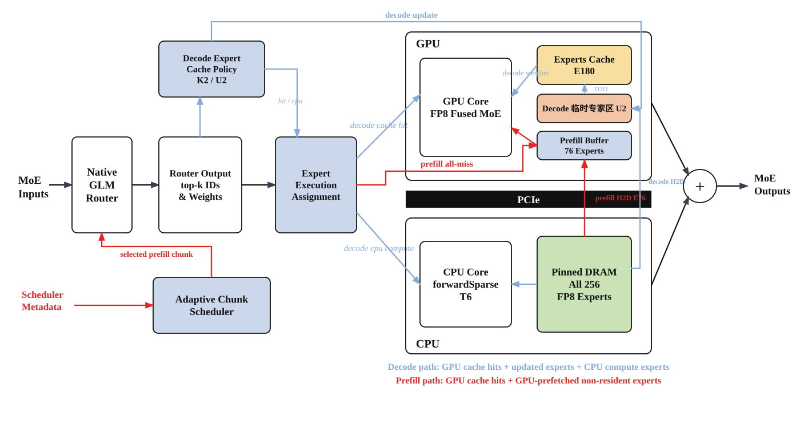

### Prefill：GPU Prefetch 与双 Buffer

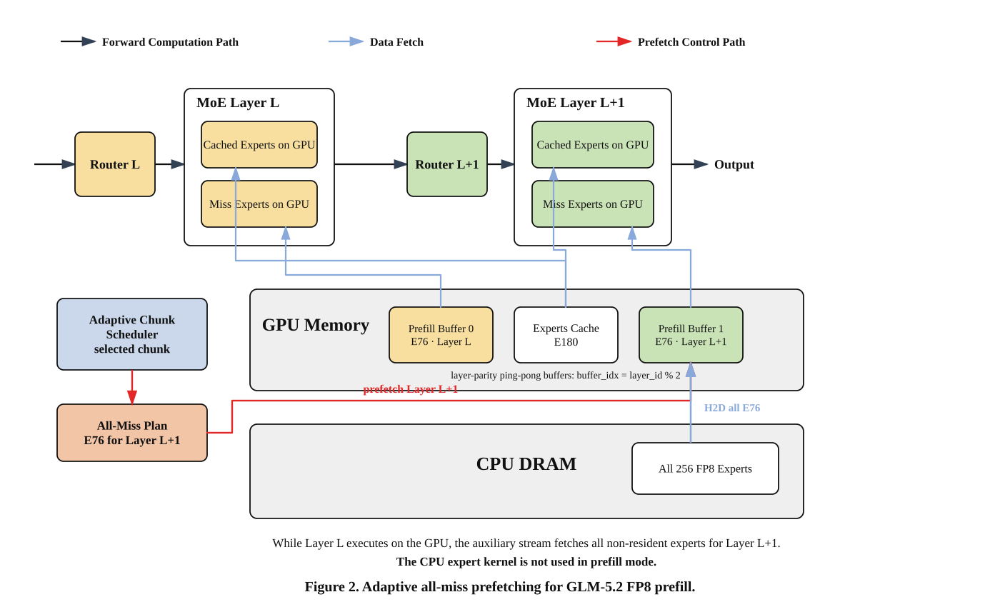

Prefill 阶段具有足够大的 Token Batch，可以用 GPU 计算隐藏专家搬运。E180
常驻 Experts Cache，其余 E76 从 Pinned DRAM 更新到按层奇偶复用的 Prefill
Buffer，最终所有 Hit/Miss Route 都在 GPU 上完成计算。

两个 Prefill Buffer 防止下一层的专家更新覆盖当前层仍在读取的专家。Adaptive
Scheduler 综合以下信息选择实际 Prefill Chunk：

- Scheduler 的硬 Token Budget；
- 8192 Token 的软目标；
- 当前是否存在活跃 Decode；
- 剩余 Prefill Tail 的大小。

它的目标不是单纯缩小 Chunk，而是生成足够的 GPU 工作来覆盖 E76 更新，同时
避免过大的 Prefill Step 长时间阻塞 Decode。

### Decode：双 uBatch CPU/GPU 重叠

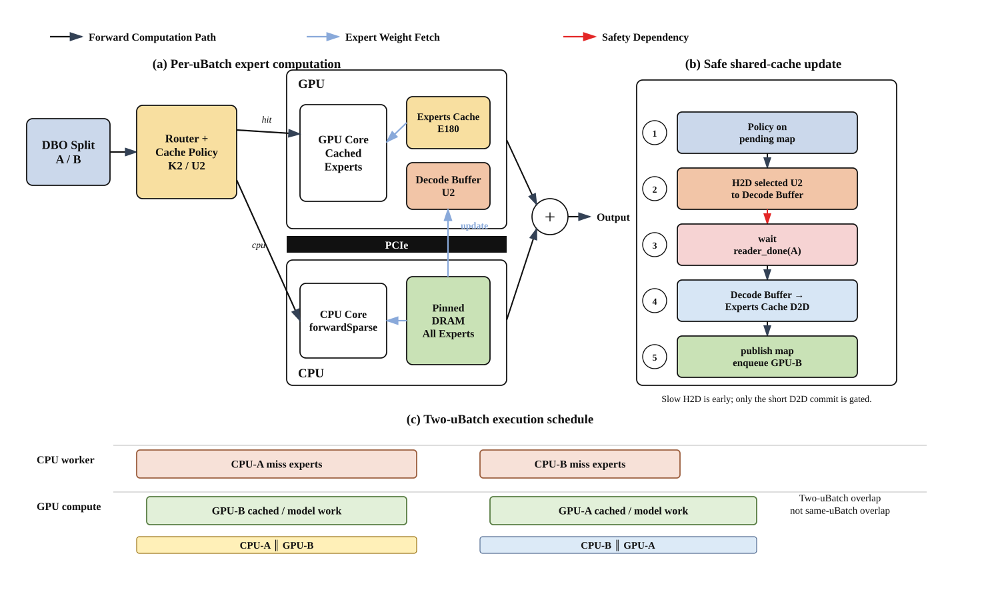

Decode 单步 Token 数较少，无法用 GPU 计算摊平一次完整的 E76 搬运，因此
采用 CPU/GPU 混合执行：

- Experts Cache 中已驻留的专家在 GPU 上执行；
- 最多 U2 个选中 Miss 先进入 Decode Buffer，再提交到 Experts Cache；
- 其余 Miss Experts 由 CPU `forwardSparse` 执行；
- DBO 将 Decode 拆成两个 uBatch，使 CPU-A 与 GPU-B 重叠，随后 CPU-B
  与 GPU-A 重叠。

Decode Buffer 与正在使用的 Experts Cache 相互独立。慢速 H2D Stage 可以
提前进行，只有最后一小段 Decode Buffer → Experts Cache 的 D2D Commit
需要等待上一位 Reader 完成。提交完成后再发布匹配的 Cache Map，从而保护
Cache Slot 所有权。

### Decode Cache Policy

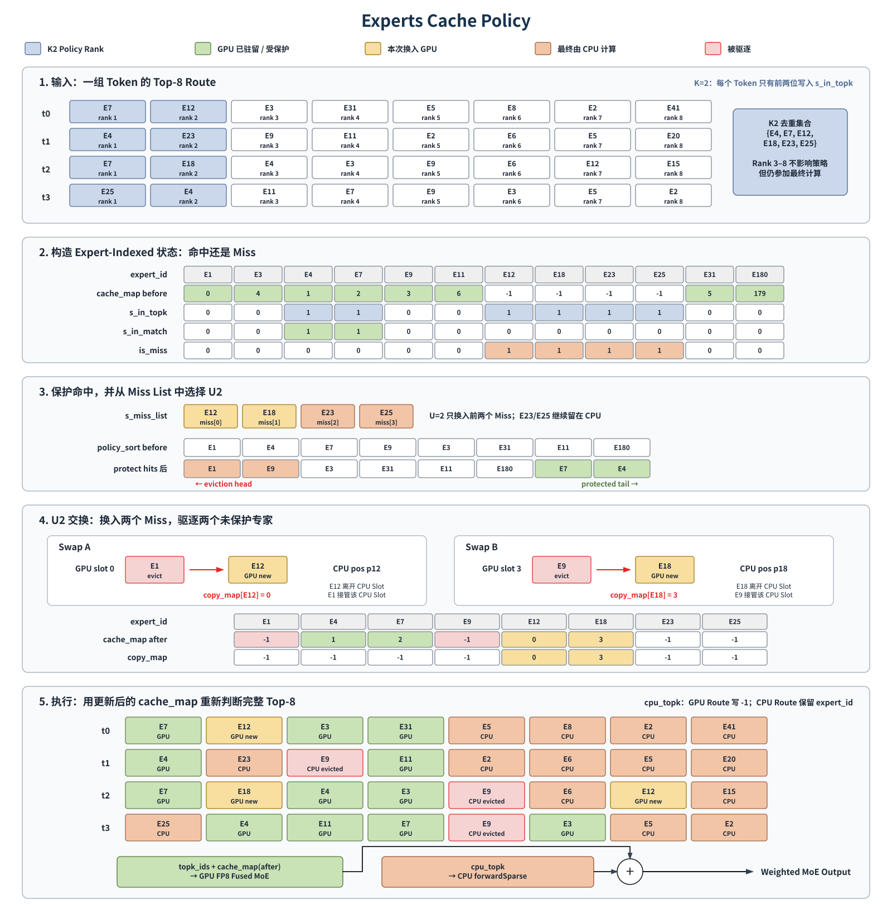

GLM 的全部 Top-8 Route 都参与最终 MoE 计算，但 K2 只将 Router 排名前两位
的专家加入 Cache 保护和更新工作集：

- K2 Cache Hit 被移动到 `policy_sort` 的受保护区域；
- 最多 U2 个唯一 K2 Miss 替换未受保护的 Victim Slot；
- 未驻留且未更新的 Route 交给 CPU 计算。

每层 Decode 的最终执行划分为：

```text
GPU Resident Hits + GPU Updated Experts + CPU Computed Experts
```
## Stats：专家与缓存统计

### 每层专家执行位置

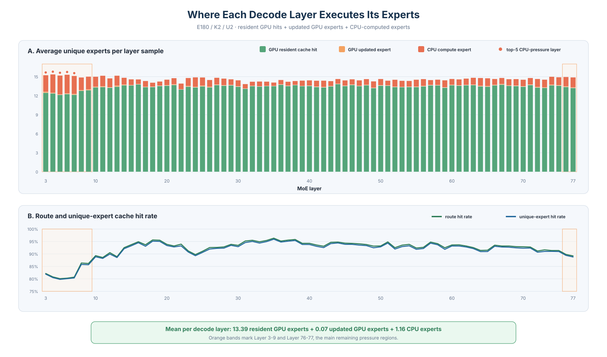

75 个 MoE Layer 的平均 Decode Layer Sample 可以拆分为：

```text
13.39 个 GPU Resident Experts
+ 0.07 个 GPU Updated Experts
+ 1.16 个 CPU Computed Experts
```

Layer 3～9 是当前最主要的 CPU 压力区，Layer 76～77 是较小的次级尾部。

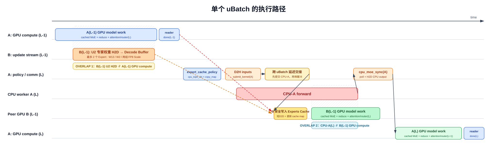
在 8K～16K 混合长度 workload 上，当前单机 TP8 系统使用一半数量的 H20，
达到了双机 TP16 全 GPU 基线 **78.8% 的输出吞吐**和 **79.3% 的总 Token
吞吐**，每卡输出效率提高约 **57.6%**

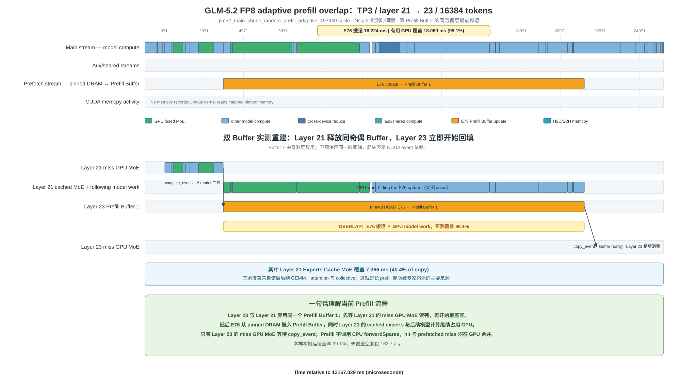

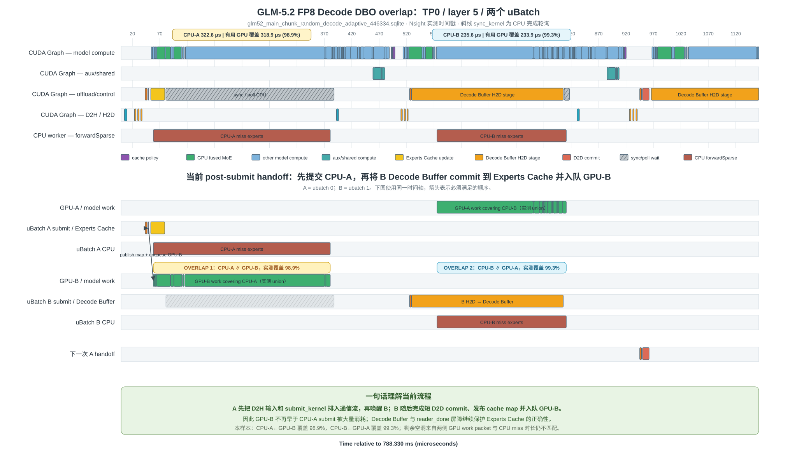


> 本仓库只包含该系统面向公开展示的设计与评测材料，源码未包含在仓库中。

## 系统配置

| 项目 | 配置 |
|---|---|
| 模型 | GLM-5.2 FP8 |
| Offload 硬件 | 单机 8 × NVIDIA H20，TP8 |
| 全 GPU 基线 | 双机 16 × NVIDIA H20，TP16 |
| 每层 Routed Experts | 256 |
| GPU Experts Cache | E180 |
| Decode Cache Policy | K2 保护 / U2 更新 |
| CPU 计算 | T6 线程池，NUMA 感知绑核 |
| Prefill | Chunked Prefill、Adaptive Chunk、双 Prefill Buffer |
| Decode | DBO、FULL_DECODE_ONLY CUDA Graph、Decode Buffer |
| KV Cache | FP8 |

## 为什么做专家级卸载

GLM-5.2 FP8 的 Routed Expert 权重无法与 KV Cache、CUDA Graph 和运行时
Workspace 一起完整驻留在目标 TP8 H20 部署中。若按整层搬运 MoE 权重，
单次传输量过大，并会让权重更新与前向计算串行。

本系统采用专家粒度的 CPU–GPU 分层：

1. 在 GPU 上保留容量受限的专家缓存；
2. 在 CPU DRAM 中保存全部专家权重；
3. 根据 Prefill 和 Decode 的计算形态采用不同卸载策略；
4. 将专家搬运或 CPU Miss 计算与有效 GPU 工作重叠；
5. 使用独立 Buffer 隔离慢速搬运和正在被读取的 Experts Cache。

## Architecture：系统架构

### 总系统架构


模型原生 Router 生成专家路由结果，Cache Lookup 将其划分为已驻留和未驻留
两条路径：

- **GPU Cache Hit**：直接使用 E180 Experts Cache 计算；
- **Prefill Miss**：预取到 Prefill Buffer 后在 GPU 上计算；
- **Decode Miss**：交给 NUMA 本地 CPU 专家线程池计算；
- 三条路径的 Routed Output 最终按照 Router Weight 加权合并。


```

### Adaptive Prefill Policy

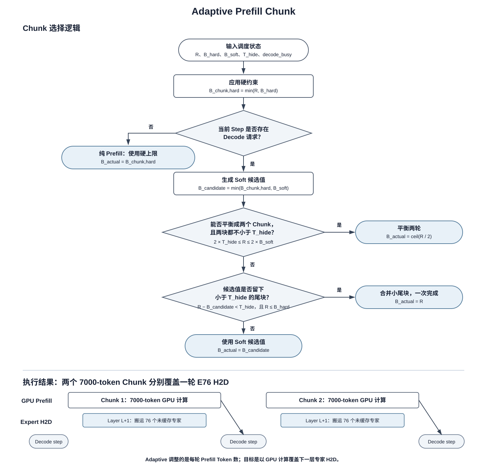

Adaptive Prefill 使用 Scheduler Metadata，而不是专家热度预测。它保留硬
Token Budget，在 Decode 活跃时应用软 Chunk 目标，平衡两个可行 Chunk，
并合并搬运占主导的小 Tail。

### 新旧 vLLM 挂载点

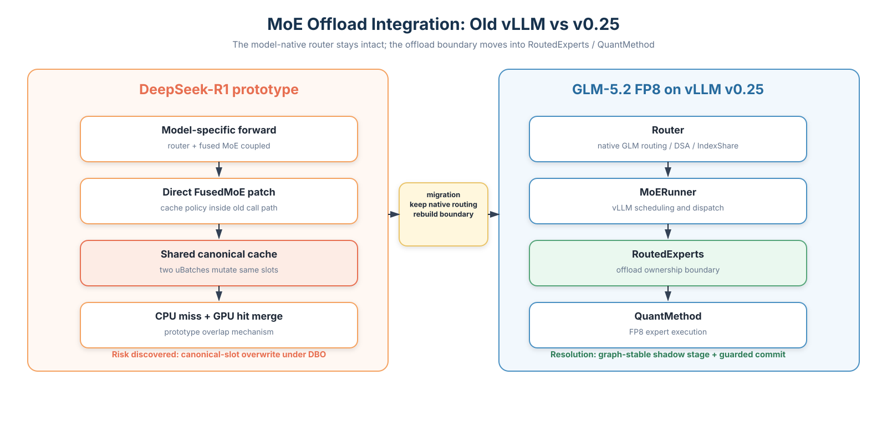

早期 DeepSeek-R1 原型直接修改旧版 Fused MoE 调用路径。GLM 版本没有
Cherry-pick 旧补丁，而是针对新版：

```text
Router → MoERunner → RoutedExperts → QuantMethod
```

重新选择挂载点和资源所有权边界，并复用 GLM 原生 Router、DSA 和
IndexShare。

## Measured：真实重叠证据

以下时序图根据真实 Nsight Systems SQLite 时间戳和 NVTX Range 重建。
图中选择的是重叠效果较好的代表性 Sample，用于证明机制确实发生，不代表
所有 Rank、Layer 和 Step 的平均值。

### Adaptive Prefill Overlap


选中 Sample：TP3、16,384 Token Prefill Chunk、Layer 21 → Layer 23 复用
Prefill Buffer 1。

| 测量项 | 数值 |
|---|---:|
| E76 Prefill Buffer 更新 | 18.224 ms |
| 有效 GPU 覆盖 | 18.060 ms |
| 更新被有效 GPU 工作覆盖的比例 | **99.10%** |
| Cached Expert MoE 覆盖 | 7.366 ms |

Layer 21 和 Layer 23 都是奇数层，会复用同一个 Ping-Pong Buffer。Layer 23
需要等 Layer 21 的 Miss Expert Reader 完成后才能覆盖该 Buffer。

Trace 中没有单独的 E76 H2D Memcpy 记录，因为
`update_expert_cache_kernel` 直接读取映射后的 Pinned Memory。

### Decode DBO Overlap


选中 Sample：TP0、Layer 5、E180/K2/U2/T6。

| CPU 区间 | CPU 时长 | 跨 uBatch 有效 GPU 覆盖 | 覆盖率 |
|---|---:|---:|---:|
| CPU-A | 322.554 µs | GPU-B 覆盖 318.906 µs | **98.87%** |
| CPU-B | 235.606 µs | GPU-A 覆盖 233.942 µs | **99.29%** |

该 Sample 同时包含 Decode Buffer H2D Stage 和短 D2D Experts Cache
Commit。`reader_done` 只保护最终提交阶段，没有将完整 H2D 搬运重新放回
关键路径。

## Performance：性能结果

### 实验口径

- Random 输入长度：8K～16K 均匀采样；
- 输出长度：128 Token；
- 请求数量：32；
- 最大并发：4；
- Temperature：0；
- TP8 Offload：Seed 1、2、3；
- TP16 Full GPU：Seed 2、3。

### 主性能结果

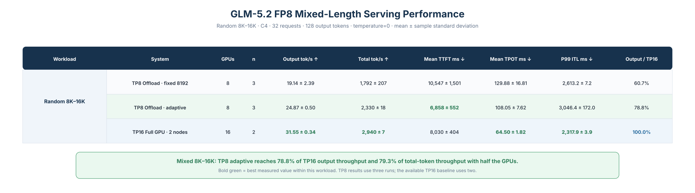

在混合长度 Serving 中，TP8 Adaptive Offload 达到：

- **24.87 output tok/s**，为 TP16 的 **78.8%**；
- **2,330 total tok/s**，为 TP16 的 **79.3%**；
- **6.86 s Mean TTFT**，低于本次 TP16 测得的 8.03 s；
- **108.05 ms Mean TPOT**，TP16 为 64.50 ms；
- **3.05 s P99 ITL**，TP16 为 2.32 s。

该结果展示的是 GPU 数量效率，而不是绝对性能优于 TP16。双机 TP16 在
Decode TPOT 和 P99 延迟上仍明显占优。

### Adaptive Prefill 消融

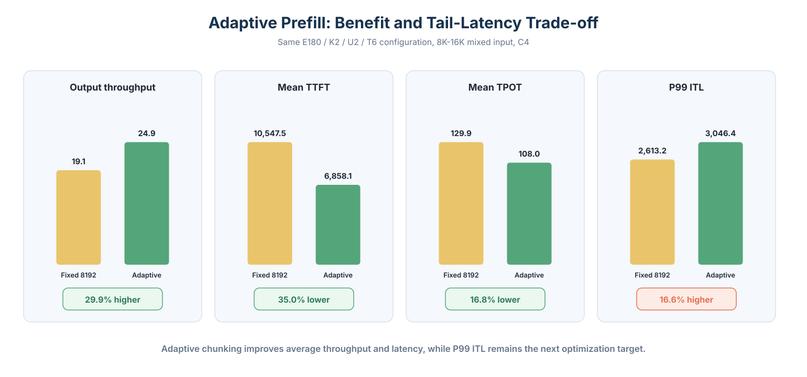

与相同 E180/K2/U2/T6 配置下固定 8192 Token Chunk 相比，Adaptive
Prefill：

- Output Throughput 提升 **29.9%**；
- Mean TTFT 降低 **35.0%**；
- Mean TPOT 降低 **16.8%**；
- P99 ITL 上升 **16.6%**。

这里保留了 P99 退化结果。Adaptive Chunk 改善了平均性能，但 Prefill/Decode
混合调度干扰和 CPU Miss 波动仍是长尾延迟瓶颈。


### Route 热度与 CPU Miss 热度


两张对齐的 Layer × Expert 热力图使用 Rank 0、DBO `ntok=2` 的统计：

- 上图表示每个专家在所属 Layer 内的 Route Share；
- 下图表示相同 Layer/Expert 坐标的 CPU Miss Count；
- 红色行框表示 CPU 压力最大的五个 Layer。

这组图可以区分“被频繁路由的热门专家”和“经常落到 CPU 的 Miss 专家”。
它不是实际搬运 Expert ID 的精确热力图；后者还需要聚合 `copy_map` 记录。

### 静态 Hotset 覆盖率

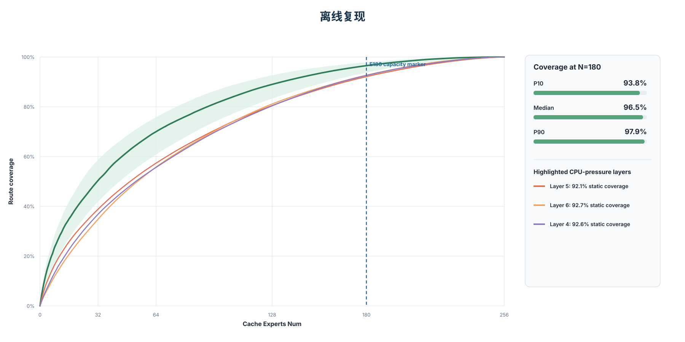

每层独立按照专家 Route 热度排序，并计算 Top-N 热门专家的累计 Route
覆盖率。当 N=180 时：

- P10：**93.8%**
- Median：**96.5%**
- P90：**97.9%**

这些结果是“每层静态 Hotset”的容量上界，不是当前动态 K2/U2 Cache Policy
的真实命中率。

### CPU 压力最大的 Layer

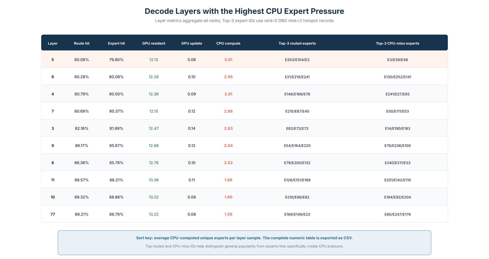

Layer 5 是当前 Decode CPU 压力最大的 Layer，平均每个 Sample 需要 CPU
计算 3.01 个专家，Route Hit Rate 为 80.08%。表格同时列出 Top Routed
Experts 和 Top CPU-Miss Experts，避免将全局热门专家直接等同于 Cache
Policy 压力来源。

## 当前限制

- TP8 Offload 与 TP16 Full GPU 使用不同数量的 GPU，因此该对比衡量的是
  资源效率，而不是同硬件条件下的加速比；
- TP8 Offload 有三次混合长度结果，当前 TP16 Baseline 只有两次；
- Nsight Overlap 图是用于说明机制的代表性 Sample，不是逐层平均结果；
- 当前缺少相同 Workload 下的 TP8 Full-GPU 基线；
- 对外的最终正确性结论仍需完成专家数值、输出合并、DBO Slot Race 和
  Eager/Graph 一致性审计；
- 精确的搬运 Expert ID 热力图仍需要聚合 `copy_map`；
- 32K、64K 和 128K 容量与性能测试仍是后续工作。

## 后续计划

- 完成并公开最终正确性矩阵；
- 在不削弱 Cache 所有权保护的前提下降低 Decode TPOT 和 P99 ITL；
- 评估 Per-Layer Pinned Hot Experts 和 Workload-Aware Cache Admission；
- 扩展到 32K、64K 和 128K Context 的容量与 Serving 测试。

## 数据与证据口径

- Architecture 图描述已经实现的机制；
- 所有带数值的 Chart 都由仓库内归一化 CSV 生成；
- 机制演进图不作为实测累计加速比；
- 最终正确性结论只会在完整 Audit 通过后加入。

图表组织方式参考了系统论文常见的 Architecture、Measured Timeline、
Performance 和 Workload Stats 分层表达，但仓库内所有图均为原创绘制。
